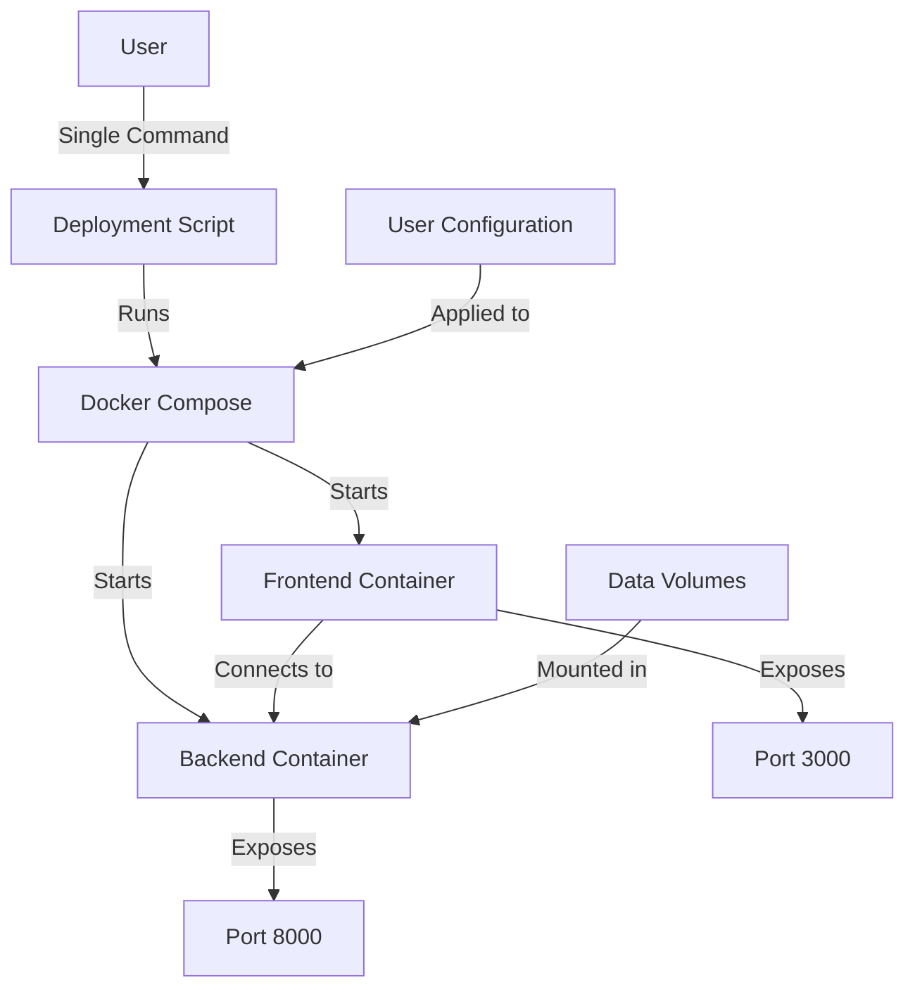

# Design Document

## Overview

This design document outlines the technical approach for enhancing the RiskAI platform's Docker setup to enable a seamless single-command deployment experience. The current setup has inconsistent port configurations and requires multiple steps to deploy. The new design will simplify the deployment process, ensure consistent port usage, and improve the overall user experience when running RiskAI in Docker.

## Architecture

### System Architecture Updates

The Docker deployment architecture will be updated with the following components:

1. **Unified Docker Compose Configuration**
   - Standardized port mappings
   - Consistent environment variable handling
   - Improved volume management for data persistence

2. **Single Command Deployment Script**
   - Platform-independent shell script
   - Intelligent port conflict detection and resolution
   - Clear user feedback and progress reporting

3. **Service Discovery and Configuration**
   - Automatic backend URL configuration for frontend
   - Health checks for service availability
   - Graceful handling of startup dependencies

### Docker Compose Configuration Updates

The docker-compose.yml file will be updated to:

1. Use consistent port mappings (3000 for frontend, 8000 for backend)
2. Improve volume configurations for better data persistence
3. Add health checks to ensure services are properly started
4. Implement proper service dependencies
5. Standardize environment variable handling



## Components and Interfaces

### 1. Unified Docker Compose Configuration

**Purpose:** Provide a standardized Docker Compose configuration that works consistently across platforms.

**Key Features:**
- Standardized port mappings (3000 for frontend, 8000 for backend)
- Consistent environment variable handling
- Improved volume management for data persistence
- Health checks for service availability
- Proper service dependencies

**Implementation Details:**
- Update docker-compose.yml to use standard ports
- Configure frontend to dynamically connect to backend
- Add health checks to ensure services are properly started
- Implement proper volume mounts for data persistence

### 2. Single Command Deployment Script

**Purpose:** Provide a simple, platform-independent script to deploy the entire RiskAI system with a single command.

**Key Features:**
- Platform-independent shell script (works on Linux, macOS, Windows with WSL)
- Intelligent port conflict detection and resolution
- Clear user feedback and progress reporting
- Automatic handling of common deployment issues

**Implementation Details:**
- Create a unified shell script that handles deployment
- Implement port conflict detection and resolution
- Add clear progress reporting and error handling
- Provide automatic handling of common deployment issues

### 3. Service Discovery and Configuration

**Purpose:** Ensure services can discover and communicate with each other regardless of port configuration.

**Key Features:**
- Automatic backend URL configuration for frontend
- Dynamic service discovery
- Graceful handling of startup dependencies

**Implementation Details:**
- Configure frontend to use environment variables for backend URL
- Implement health checks to ensure services are available
- Add retry logic for service connections

## Data Models

### Docker Compose Configuration Model

```yaml
version: '3.8'
services:
  backend:
    build:
      context: .
      dockerfile: Dockerfile.backend
    ports:
      - "${BACKEND_PORT:-8000}:8000"
    volumes:
      - ./data:/app/data
      - ./vectordb:/app/vectordb
      - ./backend/database_data:/app/database_data
    environment:
      PDF_DATA_DIR: /app/data
      DB_PERSIST_DIR: /app/vectordb
      DATABASE_DIR: /app/database_data
      PYTHONUNBUFFERED: "1"
    healthcheck:
      test: ["CMD", "curl", "-f", "http://localhost:8000/health"]
      interval: 30s
      timeout: 10s
      retries: 3
      start_period: 40s
    networks:
      - riskai_network

  frontend:
    build:
      context: .
      dockerfile: Dockerfile.frontend
      args:
        NEXT_PUBLIC_API_URL: http://localhost:${BACKEND_PORT:-8000}
    ports:
      - "${FRONTEND_PORT:-3000}:3000"
    depends_on:
      backend:
        condition: service_healthy
    environment:
      NODE_ENV: production
      NEXT_PUBLIC_API_URL: http://localhost:${BACKEND_PORT:-8000}
    healthcheck:
      test: ["CMD", "curl", "-f", "http://localhost:3000/api/health"]
      interval: 30s
      timeout: 10s
      retries: 3
      start_period: 20s
    networks:
      - riskai_network

networks:
  riskai_network:
    driver: bridge
```

### Deployment Script Model

```bash
#!/bin/bash

# RiskAI Docker Deployment Script
# This script provides a simple way to deploy the RiskAI application with Docker

# Default configuration
FRONTEND_PORT=3000
BACKEND_PORT=8000
COMPOSE_FILE="docker-compose.yml"

# Function to check if a port is in use
check_port() {
  local port=$1
  # Platform-independent port check
  # Implementation details...
}

# Function to handle port conflicts
handle_port_conflicts() {
  # Implementation details...
}

# Function to display progress
show_progress() {
  # Implementation details...
}

# Main deployment function
deploy_riskai() {
  # Check for port conflicts
  handle_port_conflicts
  
  # Set environment variables
  export FRONTEND_PORT
  export BACKEND_PORT
  
  # Start services
  docker-compose -f $COMPOSE_FILE up -d
  
  # Display access information
  echo "RiskAI is now running!"
  echo "Frontend: http://localhost:$FRONTEND_PORT"
  echo "Backend: http://localhost:$BACKEND_PORT"
}

# Execute deployment
deploy_riskai
```

## Error Handling

The system will implement comprehensive error handling for all components:

1. **Port Conflict Resolution**
   - Detection of port conflicts
   - Automatic suggestion of alternative ports
   - Clear error messages when ports cannot be used

2. **Service Startup Failures**
   - Detection of service startup failures
   - Detailed error reporting
   - Suggestions for resolving common issues

3. **Volume Mount Issues**
   - Detection of volume mount failures
   - Guidance for resolving permission issues
   - Automatic creation of required directories

4. **Network Configuration Issues**
   - Detection of network configuration problems
   - Guidance for resolving network issues
   - Fallback options for common network problems

## Testing Strategy

The testing strategy will include:

1. **Platform Testing**
   - Test deployment on Linux, macOS, and Windows
   - Verify consistent behavior across platforms
   - Identify and address platform-specific issues

2. **Port Configuration Testing**
   - Test default port configuration
   - Test alternative port configuration
   - Verify port conflict resolution

3. **Data Persistence Testing**
   - Test data persistence across container restarts
   - Verify volume mount configurations
   - Test data migration scenarios

4. **Error Handling Testing**
   - Test error detection and reporting
   - Verify error resolution guidance
   - Test recovery from common failure scenarios

## Implementation Considerations

### Platform Compatibility

To ensure compatibility across different platforms:
- Use platform-independent shell commands where possible
- Provide alternative implementations for platform-specific features
- Test thoroughly on all supported platforms

### Port Configuration

For flexible port configuration:
- Use environment variables for port configuration
- Implement intelligent port conflict detection
- Provide clear guidance for port configuration

### Data Persistence

For reliable data persistence:
- Use named volumes for critical data
- Document volume locations and purposes
- Implement proper permission handling

### Documentation

Comprehensive documentation will include:
- Step-by-step deployment instructions
- Troubleshooting guidance
- Port configuration instructions
- Data persistence information
- Common usage scenarios

## Deployment Strategy

The deployment will follow a phased approach:
1. Update docker-compose.yml with standardized configuration
2. Implement single command deployment script
3. Add service discovery and health checks
4. Test on all supported platforms
5. Create comprehensive documentation