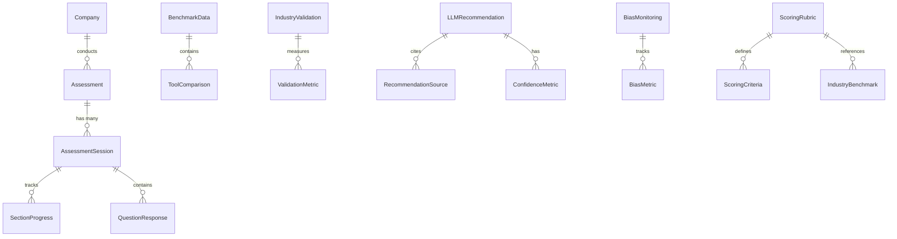

# Design Document

## Overview

This design document outlines the technical approach for creating a comprehensive 120-question cybersecurity risk assessment system with mathematical scoring, AI-powered feedback, and improved user interface. The design addresses research paper feedback by implementing quantitative benchmarking, LLM verification, bias mitigation, and clear scoring methodologies while providing a modern, fully functional web application.

## Architecture

### System Architecture Updates

The current RiskAI architecture will be enhanced with the following core components:

1. **120-Question Assessment Engine**
   - Structured question bank across 12 security domains
   - Dynamic question flow with conditional logic
   - Real-time progress tracking and auto-save functionality
   - Multi-format question types (multiple choice, rating scales, yes/no, text)

2. **Mathematical Scoring System**
   - Weighted scoring algorithms with defined formulas
   - Real-time score calculation and display
   - Section-level and overall risk scoring
   - Statistical confidence intervals and benchmarking

3. **AI-Powered Feedback Generator**
   - LLM integration for strategic recommendations
   - Source attribution and confidence scoring
   - Bias detection and mitigation mechanisms
   - Categorized recommendations (immediate, short-term, strategic)

4. **Enhanced User Interface Framework**
   - Modern, responsive design system
   - Interactive dashboard with data visualizations
   - Improved navigation and user experience
   - Consistent styling across all application pages

5. **Comprehensive Reporting System**
   - PDF report generation with mathematical details
   - Executive summaries and technical deep-dives
   - Industry benchmarking and comparative analysis
   - Implementation roadmaps and action plans

6. **Data Persistence and Session Management**
   - Robust session handling for long assessments
   - Progress saving and restoration capabilities
   - Multi-user support with role-based access
   - Audit trails and compliance tracking

### Data Model Updates

The following updates will be made to the database schema:



New tables to be added:

1. **AssessmentSession**
   - session_id (PK)
   - assessment_id (FK)
   - user_id
   - start_time
   - last_activity
   - completion_status
   - current_section
   - current_question

2. **SectionProgress**
   - progress_id (PK)
   - session_id (FK)
   - section_id
   - completion_percentage
   - completed_questions
   - total_questions
   - last_question_answered

3. **BenchmarkData**
   - benchmark_id (PK)
   - tool_name
   - category
   - metric_name
   - metric_value
   - measurement_date
   - measurement_methodology
   - source_reference

4. **IndustryValidation**
   - validation_id (PK)
   - industry_sector
   - company_size
   - assessment_count
   - average_accuracy
   - confidence_interval
   - validation_methodology
   - validation_date

5. **LLMRecommendation**
   - recommendation_id (PK)
   - assessment_id (FK)
   - recommendation_text
   - confidence_score
   - reasoning_path
   - frameworks_referenced
   - implementation_difficulty
   - expected_impact
   - generation_timestamp

6. **BiasMonitoring**
   - monitoring_id (PK)
   - recommendation_id (FK)
   - bias_score
   - fairness_metrics
   - transparency_score
   - mitigation_actions
   - review_status

7. **ScoringRubric**
   - rubric_id (PK)
   - category_id (FK)
   - score_level
   - criteria_description
   - industry_examples
   - evidence_requirements
   - typical_benchmark

## Components and Interfaces

### 1. 120-Question Assessment Engine

**Purpose:** Deliver a comprehensive cybersecurity risk assessment across 12 security domains.

**Question Structure:**
- **Governance (10 questions)** - Weight: 20%
- **Asset Management (10 questions)** - Weight: 8%
- **Data Protection (10 questions)** - Weight: 12%
- **Access Control (10 questions)** - Weight: 12%
- **Security Monitoring (10 questions)** - Weight: 10%
- **Incident Response (10 questions)** - Weight: 10%
- **Business Continuity (10 questions)** - Weight: 8%
- **Security Awareness (10 questions)** - Weight: 6%
- **Compliance (10 questions)** - Weight: 4%
- **Emerging Technologies (10 questions)** - Weight: 4%
- **Third Party Risk (10 questions)** - Weight: 4%
- **Risk Management (10 questions)** - Weight: 2%

**Components:**
- **QuestionBank**: Manages the 120 structured questions with metadata
- **AssessmentFlow**: Controls question presentation and navigation
- **ResponseHandler**: Processes and validates user responses
- **ProgressTracker**: Real-time progress tracking and auto-save

**Interfaces:**
- `GET /api/assessment/questions`: Get all 120 questions organized by domain
- `GET /api/assessment/questions/{domain}`: Get questions for specific domain
- `POST /api/assessment/response`: Submit answer for a specific question
- `GET /api/assessment/progress/{session_id}`: Get current progress status
- `PUT /api/assessment/progress/{session_id}`: Update progress and save state

### 2. Mathematical Scoring System

**Purpose:** Provide precise, quantitative risk scoring with defined mathematical formulas.

**Scoring Formulas:**
```
Section Score = Σ(Question Score × Question Weight) / Σ(Question Weights) × 100

Overall Score = Σ(Section Score × Section Weight)

Where Section Weights:
- Governance: 20%
- Technical Controls (Asset Mgmt + Data Protection + Access Control + Monitoring): 40%
- Operational (Incident Response + Business Continuity + Awareness): 25%
- Compliance (Compliance + Emerging Tech + Third Party + Risk Mgmt): 15%
```

**Risk Level Categories:**
- Critical Risk: 0-40 (Immediate action required)
- High Risk: 41-60 (Priority improvements needed)
- Medium Risk: 61-80 (Moderate improvements recommended)
- Low Risk: 81-100 (Maintain current practices)

**Components:**
- **ScoringEngine**: Implements mathematical formulas and calculations
- **WeightManager**: Manages question and section weights
- **BenchmarkCalculator**: Computes statistical benchmarks and confidence intervals
- **RiskCategorizer**: Assigns risk levels based on numerical scores

**Interfaces:**
- `POST /api/scoring/calculate`: Calculate scores for completed assessment
- `GET /api/scoring/formula`: Get detailed scoring methodology
- `GET /api/scoring/weights`: Get current question and section weights
- `GET /api/scoring/benchmarks/{industry}`: Get industry-specific benchmarks
- `POST /api/scoring/export`: Generate detailed scoring report

### 3. AI-Powered Feedback Generator

**Purpose:** Generate intelligent, actionable recommendations based on assessment results and scoring patterns.

**Feedback Categories:**
- **Immediate Actions (0-30 days)**: Critical security gaps requiring urgent attention
- **Short-term Improvements (1-6 months)**: Important enhancements to strengthen security posture
- **Strategic Initiatives (6+ months)**: Long-term investments in security capabilities

**Components:**
- **RecommendationEngine**: Analyzes assessment responses and generates tailored advice
- **SourceAttributor**: Links recommendations to authoritative frameworks (NIST, ISO 27001, etc.)
- **ConfidenceCalculator**: Assigns confidence scores to recommendations
- **BiasDetector**: Identifies and mitigates potential AI bias in recommendations
- **FeedbackFormatter**: Structures recommendations for different audiences (technical, executive)

**Interfaces:**
- `POST /api/feedback/generate`: Generate AI recommendations for completed assessment
- `GET /api/feedback/{assessment_id}`: Retrieve generated feedback and recommendations
- `GET /api/feedback/{assessment_id}/sources`: Get source attribution for recommendations
- `POST /api/feedback/{assessment_id}/export`: Generate comprehensive feedback report
- `PUT /api/feedback/{recommendation_id}/rating`: Allow users to rate recommendation quality

### 4. Enhanced User Interface Framework

**Purpose:** Provide a modern, responsive, and intuitive user experience across all application pages.

**Design System Components:**
- **Navigation**: Consistent header with clear menu structure and breadcrumbs
- **Dashboard Cards**: Modern card-based layout with icons, metrics, and action buttons
- **Data Visualizations**: Interactive charts, progress bars, and score displays
- **Forms**: Intuitive form layouts with validation and user guidance
- **Responsive Design**: Mobile-first approach with breakpoints for all screen sizes

**Page Enhancements:**
- **Assessment Page**: Step-by-step wizard with progress tracking and question navigation
- **Reports Page**: Interactive dashboards with filtering and export capabilities
- **Validation Page**: Statistical displays with confidence intervals and industry comparisons
- **Benchmarks Page**: Comparative charts and tool comparison matrices
- **Chat Page**: Modern chat interface with AI assistant integration
- **Metrics Page**: Real-time dashboards with KPI tracking and trend analysis
- **Settings Page**: User preferences and system configuration options

**Components:**
- **DesignSystem**: Centralized styling and component library
- **NavigationManager**: Handles routing and menu state management
- **DataVisualization**: Reusable chart and graph components
- **FormBuilder**: Dynamic form generation with validation
- **ResponsiveLayout**: Adaptive layouts for different screen sizes

**Interfaces:**
- `GET /api/ui/theme`: Get current theme and styling configuration
- `GET /api/ui/navigation`: Get navigation menu structure
- `POST /api/ui/preferences`: Save user interface preferences
- `GET /api/ui/components`: Get available UI component library
- `POST /api/ui/feedback`: Submit UI/UX feedback

### 5. AI Ethics and Bias Mitigation Framework

**Purpose:** Address concerns about AI bias and ethical considerations in recommendations.

**Components:**
- **BiasDetector**: Identifies potential biases in LLM outputs
- **FairnessMonitor**: Tracks fairness metrics across recommendations
- **TransparencyReporter**: Generates reports on AI decision-making

**Interfaces:**
- `GET /api/ethics/bias/{recommendation_id}`: Get bias analysis for a recommendation
- `GET /api/ethics/fairness/metrics`: Get overall fairness metrics
- `GET /api/ethics/transparency/report`: Generate transparency report
- `POST /api/ethics/feedback`: Submit feedback on ethical concerns
- `GET /api/ethics/documentation`: Access ethics documentation

### 6. Enhanced Scoring System

**Purpose:** Provide clear guidelines and rubrics for consistent risk scoring.

**Components:**
- **RubricManager**: Manages detailed scoring rubrics for each category
- **EvidenceCollector**: Gathers justification for scores
- **ConsistencyChecker**: Identifies potential inconsistencies in scoring

**Interfaces:**
- `GET /api/scoring/rubrics/{category_id}`: Get scoring rubric for a category
- `GET /api/scoring/examples/{industry_id}/{category_id}`: Get industry-specific examples
- `POST /api/scoring/evidence/{question_id}`: Submit evidence for a score
- `GET /api/scoring/consistency/{assessment_id}`: Check for scoring inconsistencies
- `GET /api/scoring/benchmarks/{industry_id}`: Get typical scores for an industry

## Data Models

### Assessment Session Data Model

```json
{
  "session_id": "string",
  "assessment_id": "string",
  "user_id": "string",
  "start_time": "datetime",
  "last_activity": "datetime",
  "completion_status": "string",
  "current_section": "string",
  "current_question": "string",
  "sections_progress": [
    {
      "section_id": "string",
      "completion_percentage": "number",
      "completed_questions": "number",
      "total_questions": "number",
      "last_question_answered": "string"
    }
  ],
  "responses": [
    {
      "question_id": "string",
      "response_value": "any",
      "response_time": "datetime"
    }
  ]
}
```

### Benchmark Data Model

```json
{
  "tool_comparison": [
    {
      "tool_name": "string",
      "metrics": [
        {
          "metric_name": "string",
          "metric_value": "number",
          "unit": "string",
          "comparison_to_riskai": "number",
          "percentage_difference": "number"
        }
      ],
      "strengths": ["string"],
      "weaknesses": ["string"],
      "cost_structure": {
        "base_cost": "number",
        "per_user_cost": "number",
        "implementation_cost": "number"
      },
      "roi_metrics": {
        "time_to_value": "string",
        "cost_savings": "number",
        "efficiency_gain": "number"
      }
    }
  ],
  "methodology": {
    "data_collection_method": "string",
    "sample_size": "number",
    "date_range": "string",
    "limitations": ["string"],
    "sources": ["string"]
  }
}
```

### Industry Validation Data Model

```json
{
  "industry_sector": "string",
  "validation_metrics": {
    "companies_assessed": "number",
    "size_distribution": {
      "small": "number",
      "medium": "number",
      "large": "number",
      "enterprise": "number"
    },
    "accuracy_metrics": {
      "overall_accuracy": "number",
      "confidence_interval": ["number", "number"],
      "precision": "number",
      "recall": "number",
      "f1_score": "number"
    },
    "recommendation_quality": {
      "relevance_score": "number",
      "actionability_score": "number",
      "expert_agreement_rate": "number"
    }
  },
  "methodology": {
    "validation_approach": "string",
    "control_measures": ["string"],
    "expert_panel_composition": ["string"],
    "statistical_methods": ["string"]
  }
}
```

### LLM Recommendation Verification Model

```json
{
  "recommendation_id": "string",
  "recommendation_text": "string",
  "confidence_metrics": {
    "overall_confidence": "number",
    "source_reliability": "number",
    "consistency_score": "number",
    "expert_validation": "boolean"
  },
  "sources": [
    {
      "source_type": "string",
      "reference": "string",
      "relevance_score": "number",
      "page_number": "number",
      "quote": "string"
    }
  ],
  "reasoning": {
    "logical_steps": ["string"],
    "assumptions": ["string"],
    "limitations": ["string"]
  },
  "implementation": {
    "difficulty": "string",
    "estimated_time": "string",
    "required_resources": ["string"],
    "expected_impact": "string"
  }
}
```

### Bias Monitoring Data Model

```json
{
  "monitoring_id": "string",
  "recommendation_id": "string",
  "bias_metrics": {
    "overall_bias_score": "number",
    "demographic_fairness": "number",
    "language_bias": "number",
    "industry_bias": "number"
  },
  "mitigation_actions": [
    {
      "action_type": "string",
      "description": "string",
      "impact_score": "number"
    }
  ],
  "transparency_metrics": {
    "explanation_completeness": "number",
    "source_attribution": "number",
    "limitation_disclosure": "number"
  },
  "review_status": {
    "reviewed_by": "string",
    "review_date": "datetime",
    "approved": "boolean",
    "comments": "string"
  }
}
```

### Scoring Rubric Data Model

```json
{
  "category_id": "string",
  "category_name": "string",
  "scoring_levels": [
    {
      "score": "number",
      "label": "string",
      "description": "string",
      "criteria": ["string"],
      "examples": [
        {
          "industry": "string",
          "example": "string"
        }
      ],
      "evidence_requirements": ["string"]
    }
  ],
  "industry_benchmarks": [
    {
      "industry": "string",
      "company_size": "string",
      "average_score": "number",
      "percentile_distribution": {
        "10": "number",
        "25": "number",
        "50": "number",
        "75": "number",
        "90": "number"
      }
    }
  ],
  "consistency_guidelines": {
    "related_categories": [
      {
        "category_id": "string",
        "relationship_type": "string",
        "expected_correlation": "number"
      }
    ],
    "validation_rules": ["string"]
  }
}
```

## Error Handling

The system will implement comprehensive error handling for all new components:

1. **Session Management Errors**
   - Session not found
   - Session expired
   - Concurrent session conflicts
   - Data corruption during restoration

2. **Benchmarking Errors**
   - Insufficient benchmark data
   - Outdated comparison metrics
   - Methodology inconsistencies
   - Source reliability issues

3. **Validation Framework Errors**
   - Insufficient industry data
   - Statistical significance issues
   - Sample size limitations
   - Methodology inconsistencies

4. **LLM Verification Errors**
   - Source attribution failures
   - Confidence calculation errors
   - Explanation generation failures
   - Contradictory sources

5. **Ethics and Bias Errors**
   - Bias detection failures
   - Fairness metric calculation errors
   - Transparency reporting issues
   - Ethical guideline violations

6. **Scoring System Errors**
   - Rubric inconsistencies
   - Evidence validation failures
   - Benchmark data gaps
   - Consistency check false positives

## Testing Strategy

The testing strategy will include:

1. **Unit Testing**
   - Test individual components and functions
   - Mock dependencies for isolated testing
   - Cover edge cases and error conditions

2. **Integration Testing**
   - Test interactions between components
   - Verify data flow between modules
   - Ensure database operations work correctly

3. **System Testing**
   - End-to-end testing of complete workflows
   - Performance testing under load
   - Security testing for new components

4. **User Acceptance Testing**
   - Testing with real users from different industries
   - Gathering feedback on usability and effectiveness
   - Validating that requirements are met

5. **Specialized Testing**
   - LLM output verification testing
   - Bias detection and mitigation testing
   - Benchmark accuracy testing
   - Cross-industry validation testing

## Implementation Considerations

### Data Migration

A data migration plan will be developed to:
- Update existing assessment data to the new schema
- Preserve historical assessment results
- Ensure backward compatibility with existing reports

### Performance Optimization

Performance considerations include:
- Efficient session state management
- Optimized database queries for large datasets
- Caching of frequently accessed benchmark data
- Asynchronous processing of LLM verification tasks

### Security Considerations

Security measures will include:
- Encryption of session data
- Access controls for sensitive benchmark information
- Audit trails for LLM recommendations
- Privacy protections for cross-industry validation data

### Deployment Strategy

The deployment will follow a phased approach:
1. Deploy assessment persistence features
2. Implement scoring rubric enhancements
3. Add LLM verification capabilities
4. Integrate bias monitoring and ethics framework
5. Deploy benchmarking and validation frameworks